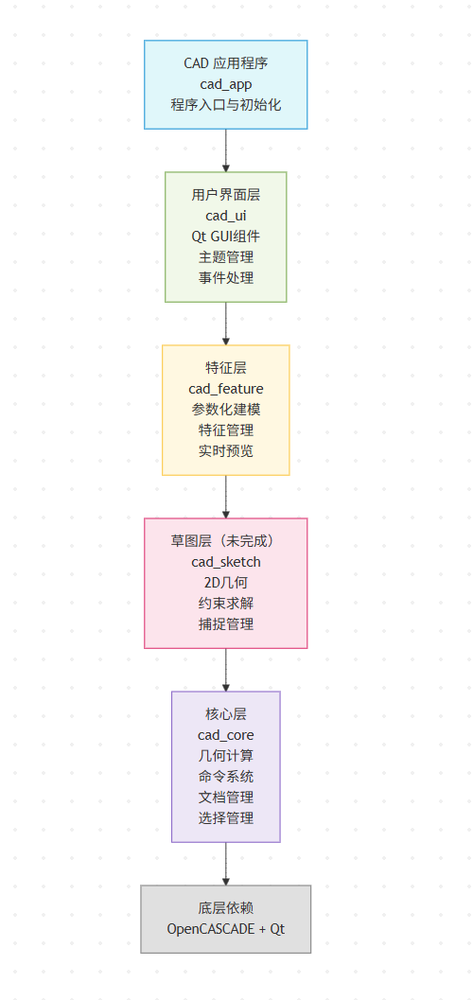

# Ander CAD - 开发者指南与架构文档

> 一个基于OpenCASCADE和Qt5的现代化参数化CAD应用程序

## 📋 目录

- [项目概述](#项目概述)
- [技术架构与设计模式](#技术架构与设计模式)
- [模块功能详解](#模块功能详解)
- [环境要求与构建](#环境要求与构建)
- [开发指南](#开发指南)
- [样式与布局定制](#样式与布局定制)
- [贡献指南](#贡献指南)

---

## 🚀 项目概述

Ander CAD是一个受Fusion 360启发的开源CAD应用程序，采用现代C++17和设计模式构建，旨在提供专业级的3D建模功能。

### 核心特性

- ✨ **参数化建模** - 基于特征的参数化设计工作流
- 🎨 **2D约束草图** - 完整的2D草图约束求解系统 (未完成)
- 🔧 **专业建模操作** - 拉伸、旋转、扫掠、放样等高级操作
- 🖥️ **现代化界面** - 基于Qt5的响应式用户界面
- 💾 **标准格式支持** - STEP、IGES、STL格式导入导出(未完成)
- 🔄 **撤销/重做系统** - 完整的操作历史管理
- 🌓 **主题支持** - 深色/浅色主题切换

### 技术栈

| 技术 | 版本 | 用途 |
|------|------|------|
| **C++** | C++17 | 核心语言 |
| **Qt** | 5.9+ | GUI框架 |
| **OpenCASCADE** | 7.8 | 几何计算内核 |
| **CMake** | 3.16+ | 构建系统 |
| **Visual Studio** | 2022 | 开发环境(Windows) |

---

## 🏗️ 技术架构与设计模式

### 整体架构模式

Ander CAD采用**分层架构（Layered Architecture）**模式，实现了高内聚低耦合的模块化设计：




## 📦 模块功能详解

### 🎯 cad_core - 核心几何引擎

**核心职责：** 几何计算、数据管理、命令系统

#### 关键组件

| 组件 | 功能 | 设计模式 |
|------|------|----------|
| `Shape` | OpenCASCADE几何体封装 | 适配器模式 |
| `ShapeFactory` | 几何体创建工厂 | 工厂模式 |
| `CommandManager` | 命令历史管理 | 命令模式 |
| `OCAFManager` | 文档数据管理 | 管理器模式 |
| `SelectionManager` | 3D选择操作 | 单例模式 |

#### 核心API

```cpp
// 几何体创建
auto box = ShapeFactory::CreateBox(Point(0,0,0), Point(10,10,10));
auto cylinder = ShapeFactory::CreateCylinder(Point(0,0,0), 5.0, 20.0);

// 命令执行
auto command = std::make_shared<CreateBoxCommand>(parameters);
commandManager->ExecuteCommand(command);
commandManager->Undo();  // 撤销操作

// 文档管理
ocafManager->AddShape(shape, "Box001");
auto shapes = ocafManager->GetAllShapes();
```

### ✏️ cad_sketch - 2D草图系统

**核心职责：** 2D几何约束、草图求解、参数化草图

#### 支持的约束类型

- **几何约束：** 平行、垂直、同心、相切
- **尺寸约束：** 长度、角度、半径、距离
- **装配约束：** 重合、对称、固定

### 🔧 cad_feature - 参数化特征系统

**核心职责：** 参数化建模操作、特征树管理、实时预览

#### 特征类型系统

```cpp
// 拉伸特征
auto extrudeFeature = std::make_shared<ExtrudeFeature>("Extrude001");
extrudeFeature->SetParameter("distance", 50.0);
extrudeFeature->SetParameter("direction", Vector3D(0,0,1));
extrudeFeature->SetProfile(sketch);

// 旋转特征  
auto revolveFeature = std::make_shared<RevolveFeature>("Revolve001");
revolveFeature->SetParameter("angle", 360.0);
revolveFeature->SetParameter("axis", Line3D(origin, zAxis));

// 特征执行
auto resultShape = extrudeFeature->CreateShape();
```

#### 特征管理器

```cpp
class FeatureManager {
public:
    void AddFeature(FeaturePtr feature);
    void RemoveFeature(FeaturePtr feature);
    void MoveFeature(FeaturePtr feature, int newIndex);
    void UpdateFeature(FeaturePtr feature);
    void RebuildAll();  // 重建整个特征树
    
    // 事件通知 (观察者模式)
    std::function<void(FeaturePtr)> OnFeatureAdded;
    std::function<void(FeaturePtr)> OnFeatureRemoved;
};
```

### 🖥️ cad_ui - 用户界面系统

**核心职责：** GUI组件、主题管理、用户交互

#### 主要界面组件

```cpp
class MainWindow : public QMainWindow {
    // 核心视图组件
    QtOccView* m_viewer;           // 3D视图器
    DocumentTree* m_documentTree;  // 文档树
    PropertyPanel* m_propertyPanel; // 属性面板
    ToolBar* m_toolBar;            // 工具栏
    StatusBar* m_statusBar;        // 状态栏
    
    // 管理器组件
    ThemeManager* m_themeManager;
    
    // 事件处理槽函数
private slots:
    void OnCreateBox();
    void OnCreateCylinder(); 
    void OnBooleanUnion();
    void OnShapeSelected(const ShapePtr& shape);
};
```

#### 主题系统

```cpp
class ThemeManager {
public:
    enum Theme { Light, Dark };
    
    void SetTheme(Theme theme);
    void LoadStyleSheet(const QString& filePath);
    QColor GetColor(const QString& colorName) const;
    
    // 单例模式
    static ThemeManager* Instance();
};
```

### 🚀 cad_app - 应用程序入口

**核心职责：** 应用初始化、系统配置、生命周期管理

```cpp
int main(int argc, char *argv[]) {
    QApplication app(argc, argv);
    
    // 应用程序配置
    app.setApplicationName("Ander CAD");
    app.setApplicationVersion("1.0.0");
    
    // OpenCASCADE初始化
    Handle(Message_PrinterOStream) printer = new Message_PrinterOStream();
    Message::DefaultMessenger()->AddPrinter(printer);
    
    // 主窗口创建和显示
    MainWindow mainWindow;
    if (!mainWindow.Initialize()) {
        return -1;
    }
    
    // 加载用户设置
    QSettings settings;
    mainWindow.restoreGeometry(settings.value("geometry").toByteArray());
    
    mainWindow.show();
    return app.exec();
}
```

---

## 🛠️ 环境要求与构建

### 系统要求

- **操作系统：** Windows 10/11 (x64)
- **编译器：** Visual Studio 2022 或更高版本
- **内存：** 最少4GB RAM (推荐8GB+)
- **显卡：** 支持DirectX 11的显卡

### 依赖库安装

#### 1. OpenCASCADE 7.8

```bash
# 下载并安装到默认路径
# 下载地址参见https://github.com/LokiAnder/OCCTraining/releases/tag/0.0.1
# 安装路径：C:\Program Files\OCCT
# 环境变量：添加 C:\Program Files\OCCT\bin 到 PATH
```

#### 2. Qt 5.9+

```bash
# 下载Qt离线安装器
# 下载地址参见https://github.com/LokiAnder/OCCTraining/releases/tag/0.0.1
# 选择组件：Qt 5.9.7 MSVC2017 64-bit
# 设置环境变量：QT_DIR=D:/Qt/Qt5.9.7/5.9.7/msvc2017_64
```


---

## 💡 开发指南

### 如何添加新功能

#### 1. 添加新的几何形状

**步骤1：** 在`ShapeFactory`中添加工厂方法

```cpp
// 在 ShapeFactory.h 中声明
class ShapeFactory {
public:
    static ShapePtr CreateTorus(const Point& center, 
                               double majorRadius, 
                               double minorRadius);
};

// 在 ShapeFactory.cpp 中实现
ShapePtr ShapeFactory::CreateTorus(const Point& center, 
                                  double majorRadius, 
                                  double minorRadius) {
    try {
        // 确保参数有效
        if (majorRadius <= 0 || minorRadius <= 0) {
            throw std::invalid_argument("圆环半径必须为正值");
        }
        
        // 使用OpenCASCADE创建圆环
        gp_Ax2 axis(gp_Pnt(center.X(), center.Y(), center.Z()), gp_Dir(0,0,1));
        BRepPrimAPI_MakeTorus torusMaker(axis, majorRadius, minorRadius);
        
        if (!torusMaker.IsDone()) {
            throw std::runtime_error("圆环创建失败");
        }
        
        return std::make_shared<Shape>(torusMaker.Shape());
    }
    catch (const Standard_Failure& e) {
        // 处理OpenCASCADE异常
        throw std::runtime_error("OpenCASCADE错误: " + std::string(e.GetMessageString()));
    }
}
```

**步骤2：** 创建对应的命令类

```cpp
// CreateTorusCommand.h
class CreateTorusCommand : public ICommand {
private:
    Point m_center;
    double m_majorRadius;
    double m_minorRadius;
    ShapePtr m_createdShape;
    
public:
    CreateTorusCommand(const Point& center, double majorRadius, double minorRadius);
    
    bool Execute() override;
    bool Undo() override;
    bool Redo() override;
    const char* GetName() const override { return "创建圆环"; }
};

// CreateTorusCommand.cpp
bool CreateTorusCommand::Execute() {
    try {
        m_createdShape = ShapeFactory::CreateTorus(m_center, m_majorRadius, m_minorRadius);
        
        // 添加到文档
        auto& ocafManager = OCAFManager::Instance();
        ocafManager.AddShape(m_createdShape, "Torus001");
        
        return true;
    }
    catch (const std::exception& e) {
        std::cerr << "圆环创建失败: " << e.what() << std::endl;
        return false;
    }
}
```

**步骤3：** 在UI中添加创建入口

```cpp
// 在 MainWindow.h 中添加槽声明
private slots:
    void OnCreateTorus();

// 在 MainWindow.cpp 中实现
void MainWindow::OnCreateTorus() {
    // 创建参数输入对话框
    bool ok;
    double majorRadius = QInputDialog::getDouble(this, "创建圆环", 
                                               "主半径:", 10.0, 0.1, 100.0, 1, &ok);
    if (!ok) return;
    
    double minorRadius = QInputDialog::getDouble(this, "创建圆环", 
                                               "次半径:", 2.0, 0.1, majorRadius, 1, &ok);
    if (!ok) return;
    
    // 执行命令
    auto command = std::make_shared<CreateTorusCommand>(
        Point(0, 0, 0), majorRadius, minorRadius);
    m_commandManager->ExecuteCommand(command);
    
    // 更新视图
    m_viewer->FitAll();
}

// 在UI初始化中连接信号槽
connect(torusAction, &QAction::triggered, this, &MainWindow::OnCreateTorus);
```

#### 2. 添加新的特征类型

**步骤1：** 创建特征类

```cpp
// SweepFeature.h
class SweepFeature : public Feature {
private:
    SketchPtr m_profile;    // 轮廓草图
    SketchPtr m_path;       // 扫描路径
    
public:
    SweepFeature(const std::string& name);
    
    // 特征接口实现
    ShapePtr CreateShape() const override;
    bool ValidateParameters() const override;
    ShapePtr CreatePreviewShape() const override;
    
    // 特征特有方法
    void SetProfile(SketchPtr profile) { m_profile = profile; }
    void SetPath(SketchPtr path) { m_path = path; }
    
    SketchPtr GetProfile() const { return m_profile; }
    SketchPtr GetPath() const { return m_path; }
};
```

**步骤2：** 实现特征逻辑

```cpp
// SweepFeature.cpp
ShapePtr SweepFeature::CreateShape() const {
    if (!ValidateParameters()) {
        throw std::invalid_argument("扫描特征参数无效");
    }
    
    try {
        // 将草图转换为OpenCASCADE线框
        TopoDS_Wire profileWire = ConvertSketchToWire(m_profile);
        TopoDS_Wire pathWire = ConvertSketchToWire(m_path);
        
        // 创建扫描面
        BRepBuilderAPI_MakeFace faceMaker(profileWire);
        if (!faceMaker.IsDone()) {
            throw std::runtime_error("轮廓面创建失败");
        }
        
        // 执行扫描操作
        BRepOffsetAPI_MakePipe pipeMaker(pathWire, faceMaker.Face());
        pipeMaker.Build();
        
        if (!pipeMaker.IsDone()) {
            throw std::runtime_error("扫描操作失败");
        }
        
        return std::make_shared<Shape>(pipeMaker.Shape());
    }
    catch (const Standard_Failure& e) {
        throw std::runtime_error("OpenCASCADE错误: " + std::string(e.GetMessageString()));
    }
}

bool SweepFeature::ValidateParameters() const {
    return m_profile != nullptr && 
           m_path != nullptr && 
           !m_profile->IsEmpty() && 
           !m_path->IsEmpty();
}
```

**步骤3：** 注册到特征管理器

```cpp
// 在FeatureManager中添加特征类型支持
enum class FeatureType {
    Extrude,
    Revolve,
    Sweep,      // 新增扫描特征
    Loft,
    // ... 其他特征
};

// 在UI中添加创建入口
void MainWindow::OnCreateSweep() {
    // 获取选中的草图
    auto selectedSketches = GetSelectedSketches();
    if (selectedSketches.size() != 2) {
        QMessageBox::warning(this, "警告", "请选择两个草图：轮廓和路径");
        return;
    }
    
    // 创建扫描特征
    auto sweepFeature = std::make_shared<SweepFeature>("Sweep001");
    sweepFeature->SetProfile(selectedSketches[0]);
    sweepFeature->SetPath(selectedSketches[1]);
    
    // 添加到特征管理器
    m_featureManager->AddFeature(sweepFeature);
}
```
-----

## 🎨 样式与布局定制

### Qt样式系统

Ander CAD使用QSS (Qt Style Sheets) 来实现主题系统，支持深色和浅色两种主题。

#### 主题文件结构

```
cad_ui/resources/
├── styles.qss          # 主样式文件
└── icons/              # 这里图标部分我还没弄，可以先不管
    ├── dark/          # 深色主题图标
    └── light/         # 浅色主题图标
```

#### 修改主题

**1. 主题文件**

```css
/* styles.qss */

/* 主窗口背景 */
QMainWindow {
    background-color: #2b2b2b;
    color: #ffffff;
}

/* 工具栏样式 */
QToolBar {
    background: qlineargradient(x1: 0, y1: 0, x2: 0, y2: 1,
                                stop: 0 #3c3c3c, stop: 1 #2b2b2b);
    border: 1px solid #1e1e1e;
    spacing: 3px;
    padding: 4px;
}

/* 按钮样式 */
QPushButton {
    background: qlineargradient(x1: 0, y1: 0, x2: 0, y2: 1,
                                stop: 0 #4a4a4a, stop: 1 #2f2f2f);
    border: 1px solid #555555;
    border-radius: 4px;
    padding: 6px 12px;
    color: #ffffff;
    font-weight: bold;
}

QPushButton:hover {
    background: qlineargradient(x1: 0, y1: 0, x2: 0, y2: 1,
                                stop: 0 #5a5a5a, stop: 1 #3f3f3f);
}

QPushButton:pressed {
    background: qlineargradient(x1: 0, y1: 0, x2: 0, y2: 1,
                                stop: 0 #2f2f2f, stop: 1 #4a4a4a);
}

/* 文档树样式 */
QTreeView {
    background-color: #3c3c3c;
    alternate-background-color: #484848;
    selection-background-color: #0078d4;
    border: 1px solid #555555;
}

QTreeView::item {
    height: 24px;
    padding: 2px;
}

QTreeView::item:selected {
    background-color: #0078d4;
}

/* 属性面板 */
QGroupBox {
    font-weight: bold;
    border: 2px solid #555555;
    border-radius: 5px;
    margin: 5px 0px;
    padding-top: 10px;
}

QGroupBox::title {
    subcontrol-origin: margin;
    left: 10px;
    padding: 0 5px 0 5px;
}
```
